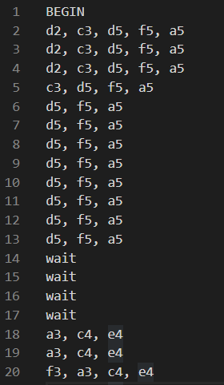
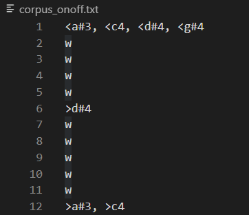
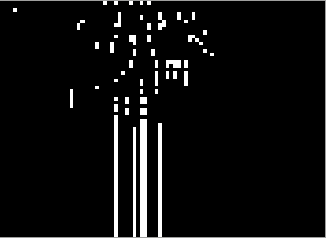
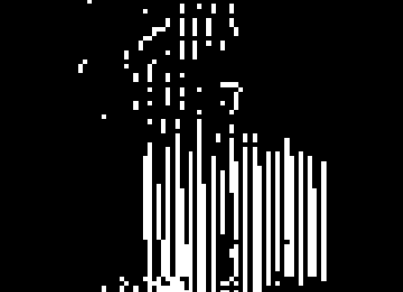
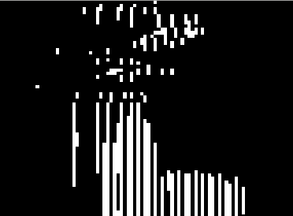
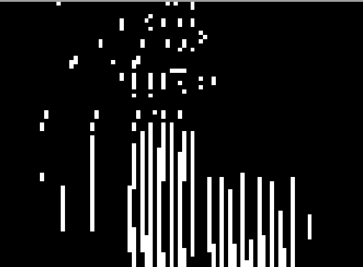
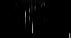
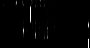
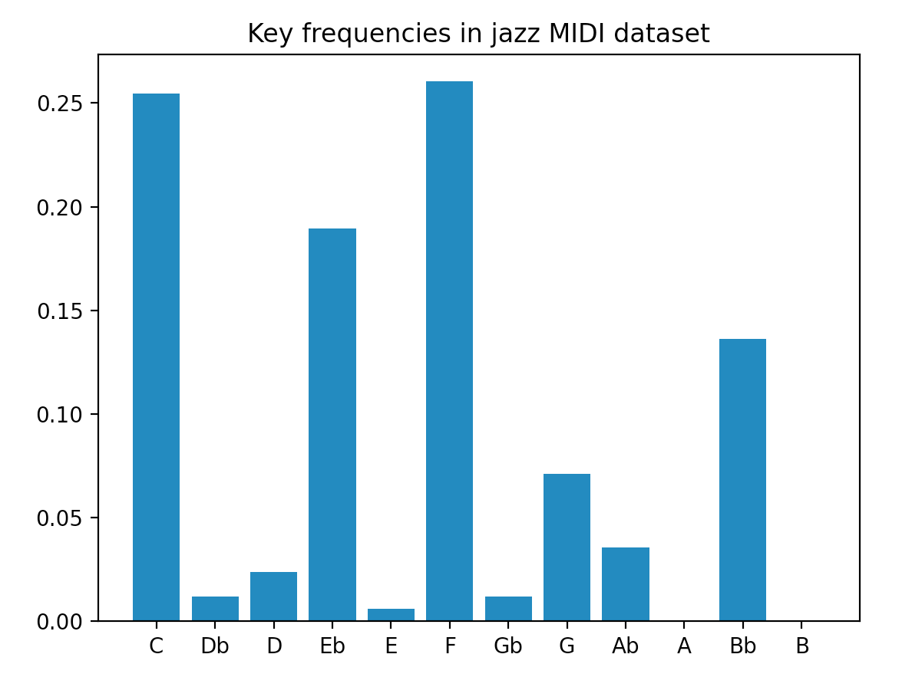

# Generating artificial jazz music using GPT2 and Seq2Seq LSTM

**Goal**: To train a machine learning model that can generate novel jazz piano

**TL;DR**: Check out some of our artificial jazz results here: [soundcloud.com/pjazz-marms](http://soundcloud.com/pjazz-marms)

### Data processing: 
The training data we used were MIDI files taken from [Doug McKenzie's jazz MIDI catalogue](http://bushgrafts.com) that were first converted into piano roll images. 
To see the current MIDI files used to train the models of our project, see [here](https://drive.google.com/drive/folders/1Q30i6j2lURjpStxhIqay73pcjgTMHNay?usp=sharing).

### Training: 
We experimented with several different types of models, but eventually settled on two main routes: text generation by finetuning GPT2 and sequence2sequence generation with an encoder-decoder LSTM model.

## Reproducability / Setup

1. Install the required dependencies

> pip install -r requirements.txt

2. Run the following command to setup the necessary directories

> python3 setup.py directories

3. Download the MIDI files (link above) and move them to `input_midi/`

4. Run the following command to auto-generate `phrases.npy` and files in `input_numpy/`, `input_images/`, and `midi_corpus/`.

> python3 setup.py process \[--verbose\] \[--overwrite\] \[--midi==INPUT_MIDI_DIR\]

From here, you should be able to run and modify `lstm.py` (many-to-one generation), `encoder_decoder.py` (seq2seq generation), and `textgen.py` (encoding and decoding MIDI to text for GPT2 processing).

## Results & Discussion

### Using [GPT2](https://openai.com/blog/better-language-models/): 

To use GPT2, we needed a pipeline to translate MIDI into text. Our first approach was to convert each timestep indidually by representing individual notes as words (e.g. `d2`), as well as special keywords like `w` for timesteps where no note is played.

<!--  -->
```
BEGIN
d2 c3 d5 f5 a5
c3 d5 f5 a5
d5 f5 a5
d5 f5 a5
d5 f5 a5
d5 f5 a5
w
w
a3 c4 e4
f3 a3 c4 e4
a3 c4 e4
a3 c4 e4
a3 c4 e4
...
```

We then implemented an on/off representation of the MIDI. In this method, we only indicated when a note began and when it ended. As opposed to the every-timestep method, this implementation is much more implicit and arguably a closer representation of how the music is actually played.

<!--  -->
```
START
^d2 <c3 <d5 <f5 <a5
>c3
w
w
w
>d5 >f5 >a5
w
w
<a3 <c4 <e4
^f3
w
w
w
...
```

Qualitatively speaking, music generated with the on/off sounded more musical, partly because it contained fewer notes and held them for longer. We can reason that with the original per-timestep preprocessing method there is no concept of notes being held, only notes played at each timestep, so the model erred on the side of too many notes. In addition, on/off is closer to representing the way music is actually played, so we reasoned that it was more intuitive to use that method.

To compensate for our relatively small dataset, we also experimented with training GPT2 on a classical corpus first, and then continuing to train it on our jazz dataset. These results can also be found in our [SoundCloud](http://soundcloud.com/pjazz-marms).

We strongly felt that a model that learned melody and harmony in parallel would result in more audibly musical output. We developed a satisfactory heuristic for separating melody from the harmony, but our challenge was in choosing the right model architecture to train both simultaneously. In our limited research time, we were unable to construct this model, although ideas are still ongoing.

### Using [Seq2Seq LSTM](https://papers.nips.cc/paper/2014/file/a14ac55a4f27472c5d894ec1c3c743d2-Paper.pdf)

Our first experiments involved designing a many-to-one LSTM model for prediction. Using our entire piano roll corpus as our training data, we trained a stacked LSTM to predict the next timestep from the last one or two measures.

However, gradient descent led our model to simply predict the previous timestep. This could have been anticipated, as such a prediction is correct or nearly correct the vast majority of the time.

<div style="text-align: center;">
  
</div>

We suspected that our high resolution was partly to blame for this result. To demonstrate this, we lowered our resolution to 2 timesteps/quarter note, and observed some variation in the output. While not unpleasant, these predictions were rhythmically too slow to be satisfactory, and still suffered the same issue of prolonged notes.

<div style="text-align: center;">
    
</div>

As a result, we chose to switch to the sequence-to-sequence encoder-decoder LSTM model. Typically, this model is used for translation-related tasks. While there is no such algorithm to "translate" from one musical phrase to the next, we hypothesized that this model may be able to at least recognize some patterns about musical phrases and mimic preceeding phrases. Our challenge was then than how to divide our music into these "phrases" (a sequence).

Our algorithm for partitioning music into phrases is predicated upon finding sufficiently long gaps in the music that would result in phrases that were neither too short nor too long. These parameters (length of the gap, minimum phrase length, maximum phrase length) could be finetuned qualitatively.

<div style="text-align: center;">
    <br>
  <i>As the encoder-decoder trained for longer, its outputs increasingly gained in confidence</i>
</div>

### A few challenges we faced:
- One significant challenge involved was the limited availability of high-quality jazz MIDI compared to available classical music datasets. For that reason, our dataset is relatively small compared to the ideal size for a deep learning ML project. This is partly what led us to experimenting with a pretrained model like GPT2.
- Jazz is an incredibly varied genre, so our dataset included blues, bebop, ballads, bossa nova, etc. Ideally we would train our models on only one genre to avoid "confusion", but this would limit the size of our dataset even further.
- Compared to its classical counterpart, jazz piano is incredibly rhythmically varied and complex; to capture every rhythmic detail would require an extremely high resolution (e.g. 24 timesteps/quarter note), which would dilute the most of the information present in the MIDI and make it difficult for models to recognize macroscopic patterns. On the other hand, low resolutions (e.g. 4 timesteps/quarter note) that classical music affords would not be able to account for triplet rhythm (swing) or faster melodies that are distinctive to jazz.
- We also faced some normalisation challenges due to jazz's chromaticism, which made it difficult to accurately key-standardize our dataset. Despite this, we found our key detection heuristic to be sufficiently accurate in aggregate; a bar plot of the keys detected in our dataset is shown below, which matched our expectation for most of the music to be in C, Eb, F, and Bb.
<div style="text-align: center;">
  
</div>

### Next steps:
- Designing a loss function to better score 'good' music
- Training harmony and melody in parallel
- Other avenues of stylistic, harmonic and rhythmic normalization


_This project was partly done as a final project for a course with [Professor Mike Izbicki](http://izbicki.me) at Claremont McKenna College._
